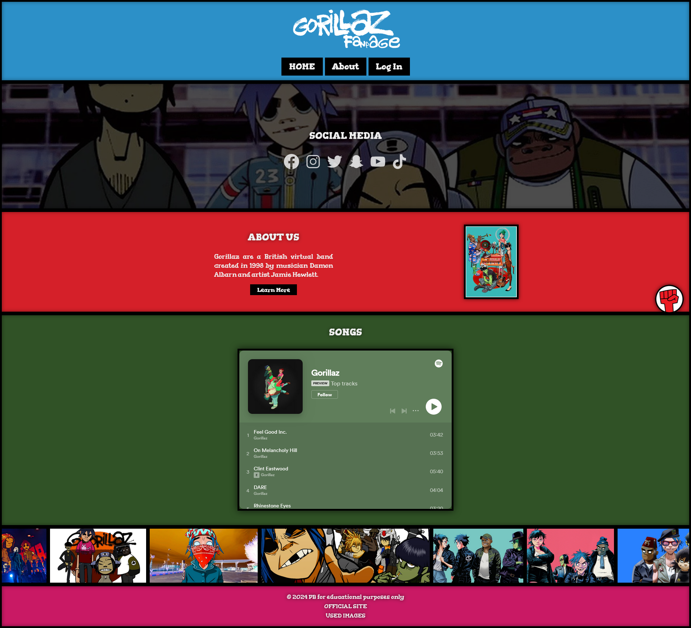
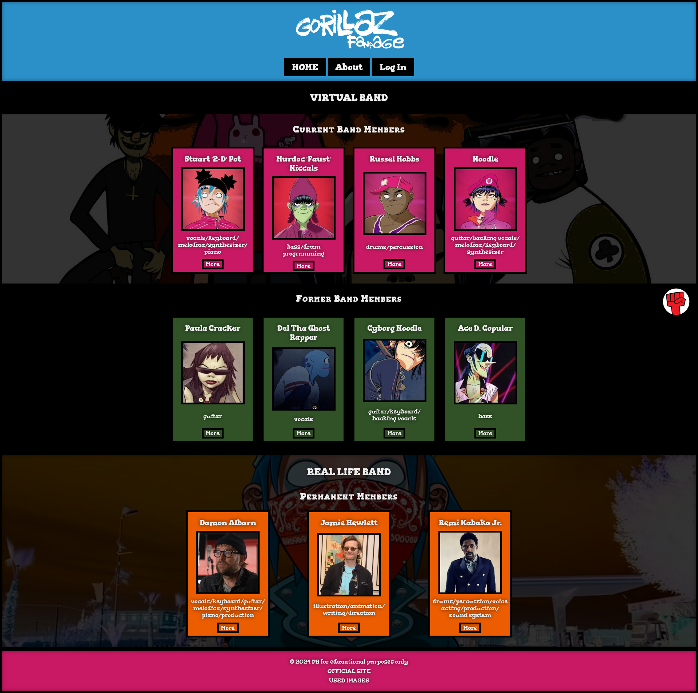
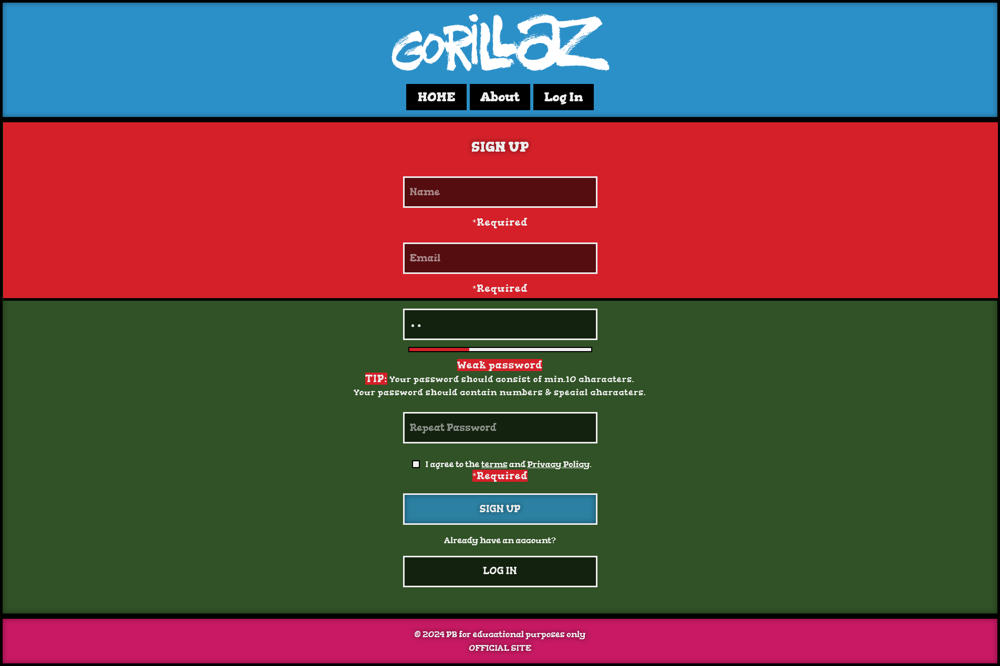
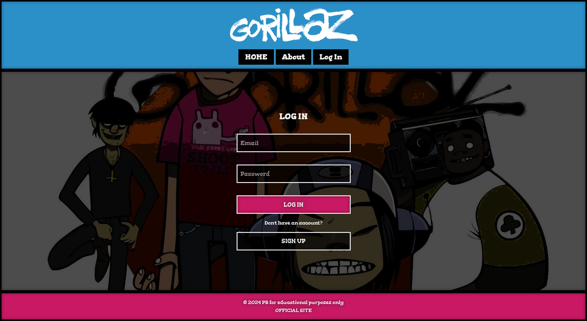
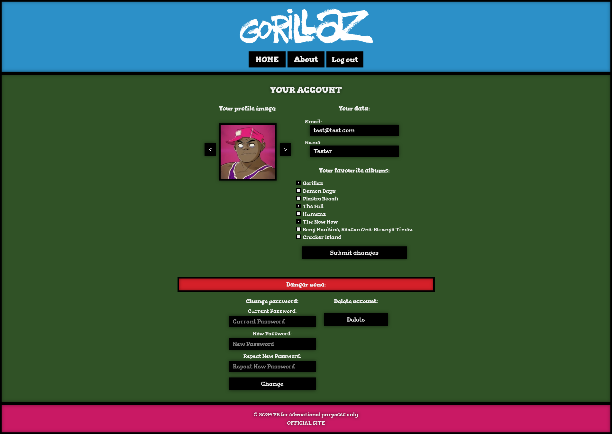

# Gorillaz

The project must be run on **localhost** because this project uses localStorage and sessionStorage between pages and also uses the fetch API to load content from files.

## Installation

Run the project on localhost. (e.g. live server, xampp)

## Demo

