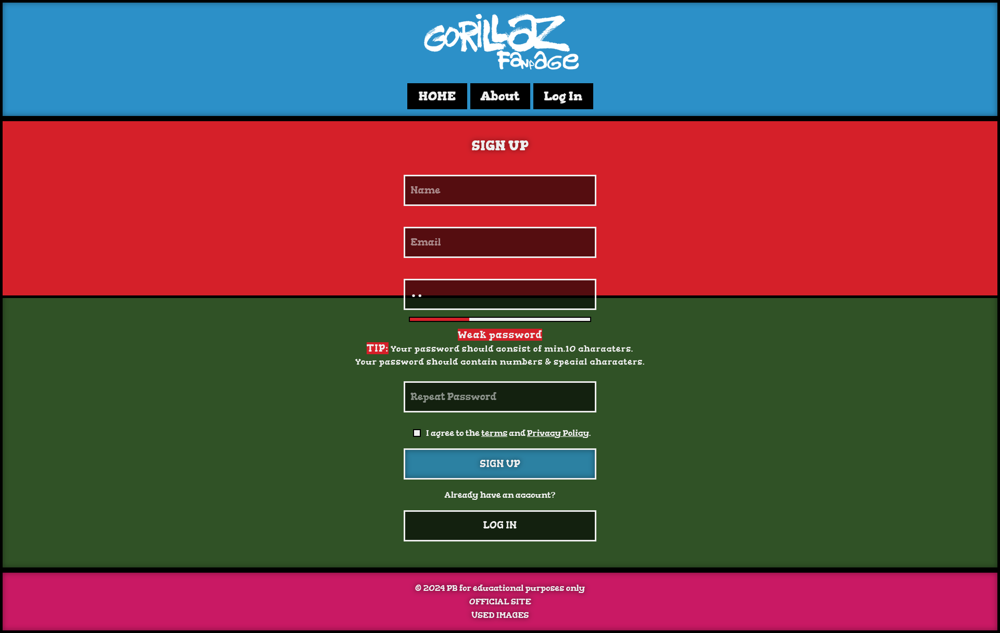
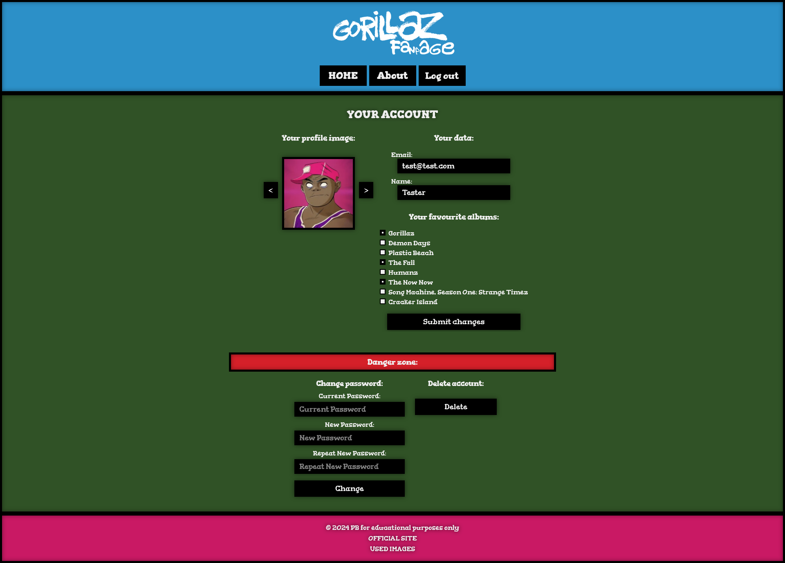

# Gorillaz

Project from the 4th semester of CS studies.

Must be run on **localhost** because this project uses localStorage and sessionStorage between pages and also uses the fetch API to load content from files.

## Installation

Run the project on localhost. (e.g. live server, xampp)

## Used images:

List of used images in file: [resources.md](./resources.md)

## Demo

